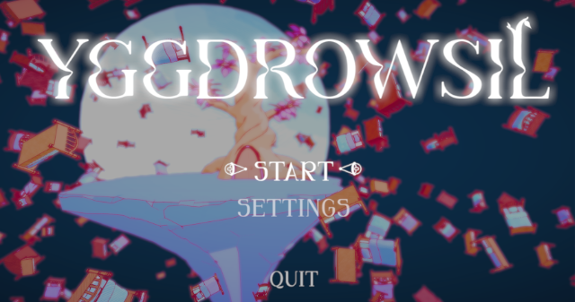
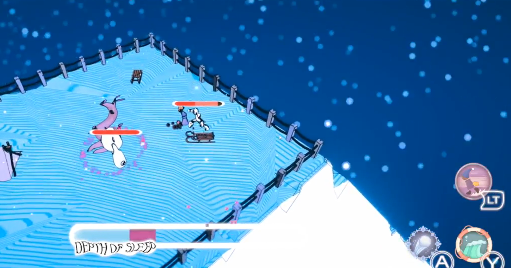
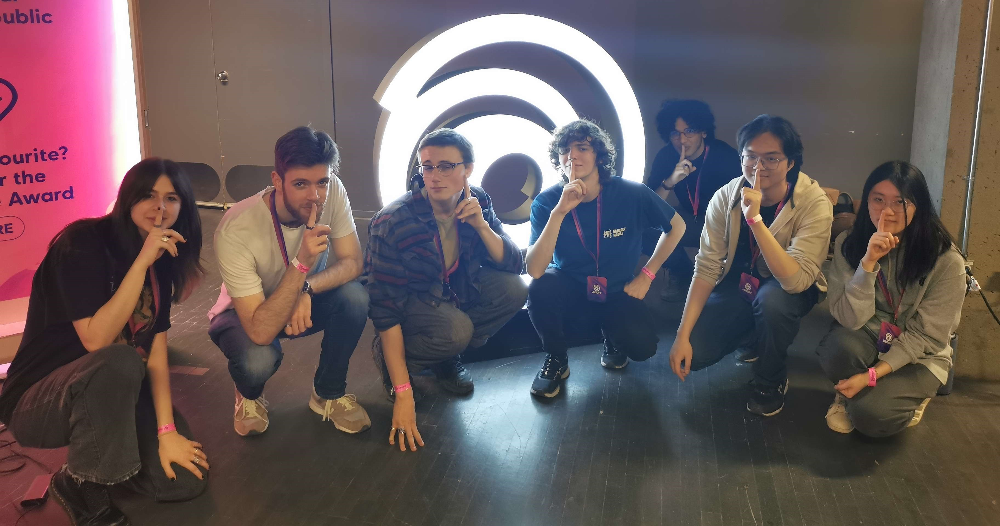
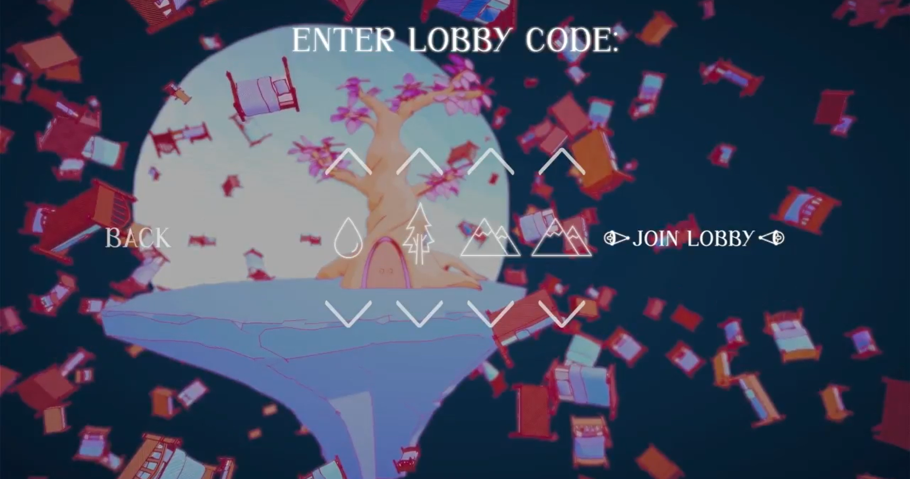
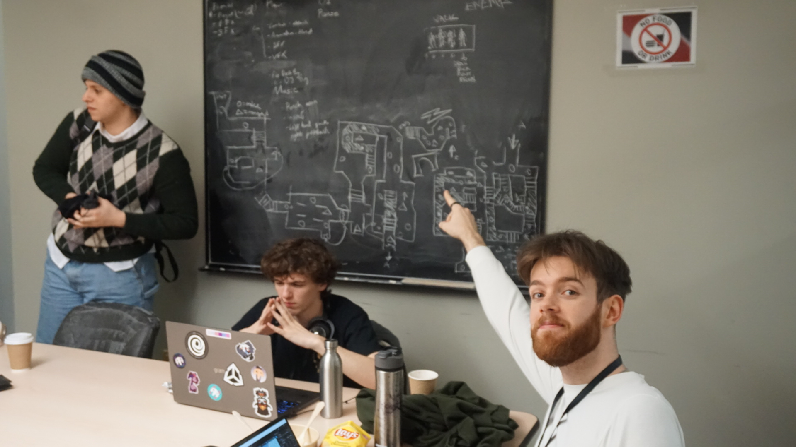
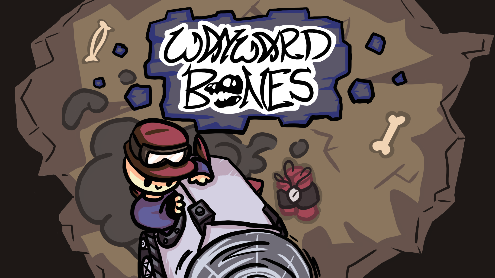
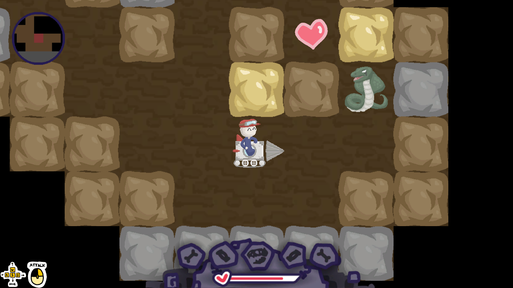
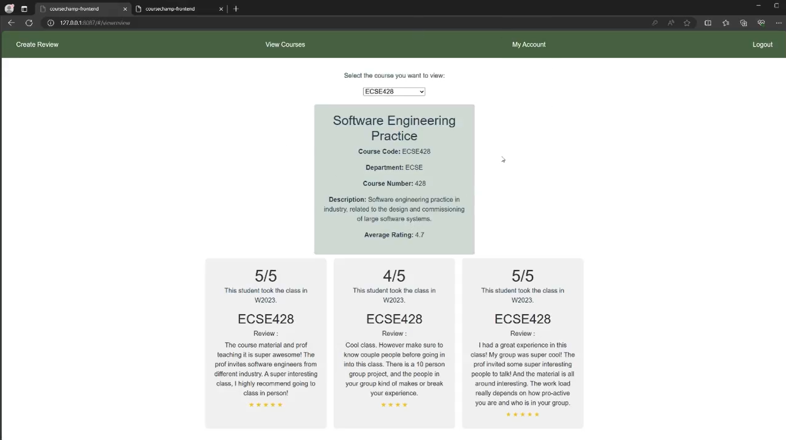
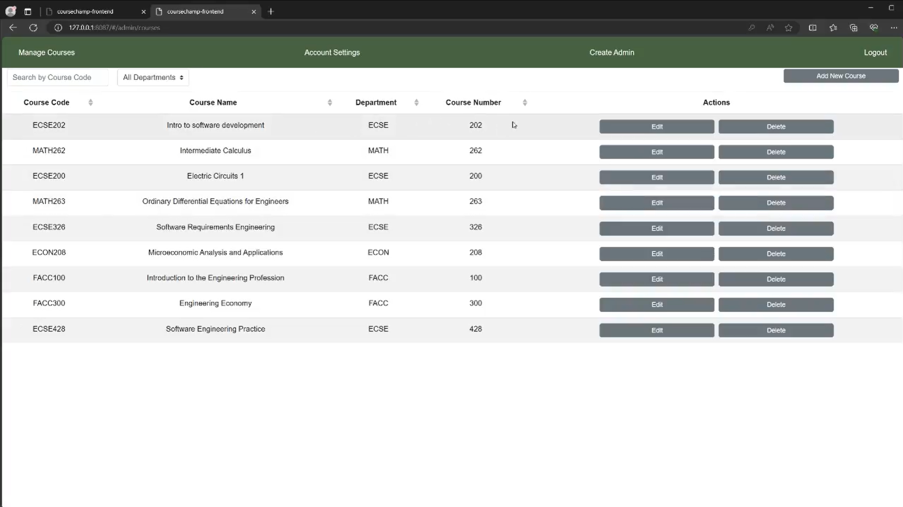

# Introduction 👋
Hello! I am Emilien Taisne and i am a software engineering student at McGill. I am passionate about Game Development 😊🎮 and I am learning everyday more about the field.

I am really interested in the networking aspects of game dev such as multiplayer architecture, data synchronozation and more! The Ubisoft GameLabs competition pushed me to learn alot about this part of game development and I love it!
# Technical Skill 🖥️
Game Engines I am proficient in:

Coding Languages I am proficient in:

## Languages 🌎
English - Fluent  
French - Native  
Chinese - Intermediate (HSK 3 level)  
# Some Repositories 👀
## Game Development Projects: 🎮
- [Yggdrowsil - Ubisoft Game Labs 2024](https://github.com/Emilien-T/GameLabs2024) : Game submitted to the **Ubisoft GameLabs competition**, worked in a team of 8, with a team of 4 programmers. I was responsible for the **multiplayer architecture** in Unity using Unity's Netcode for Gameobjects. I developped the **Lobby system** to that players can connect to each other using symboles for a accessible system. I also worked on the **replication** so that each player sees the same game and see each other using abilities, dash, select levels ect. Finally I was in charge of **leading** the programmer team so that we are coordinated and that everyone has work to do and merging our work correctly.     
- [Wizard Handz - McGameJam 2025](https://github.com/CRook99/McGameJam2025) : Wizard handz was made in McGameJam 2025 when me and my team were also volunteers / organizers for the jam, so this is alot smaller of a game. We just wanted to make a doom like game where you could just beat up monsters and run through rooms. I was mostly busy at the beginning of the jam so I was mostly responsible for bug fixing, allowing the game to be published (with a full game loop) on itch in the end.   
- [Brazen Bull - McGameJam 2024](https://github.com/EzNoGame/McGill-Game-Jam-2024) : Made during McGameJam 2024, this game was our first game with my gamelabs team. So we were 8 and we were testing out of collaboration skills, our time management and learning each others strengths. In the end we made a "horror" + puzzle game where a mechanical robot chases you around while you solve puzzles. I was responsible for leading and coordinating the team, we had to re-scope the poject and the enemy AI. It was a great learning experience for the months that were to come in the GameLabs competition.  
- [Mega Melee Madness - IN PROGRESS](https://github.com/Emilien-T/MMM-unity)
- McGill VR Hot Dog Game - IN PROGRESS
- [WayWard Bones - McGameJam 2022](https://github.com/nicktstewart/McGameJam) : This was my first gamejam. I learned so much during this experience. We were working in a team of 6 and I was responsible for most of the programming of the 2D mining part of the game. I already had done projects on Unity, but this experience really pushed me to know the engine. The main difficulty points for me was implementing the procedural generation of the map, loading and unloading the map around the player and the "shadow" effect. I had such a good experience I continued my journey into the game development world.    

## School Projects: 🎓
- [Raytracer - COMP 557](https://github.com/Emilien-T)       
- [Course Champ - ECSE 428](https://github.com/Emilien-T/CourseChamp)    
- [Parking Lot Management System - ECSE 321](https://github.com/McGill-ECSE321-W23/project-group-01)   
- [Lego Robot - ECSE 211](https://github.com/julia-b-grenier/ecse211)   
